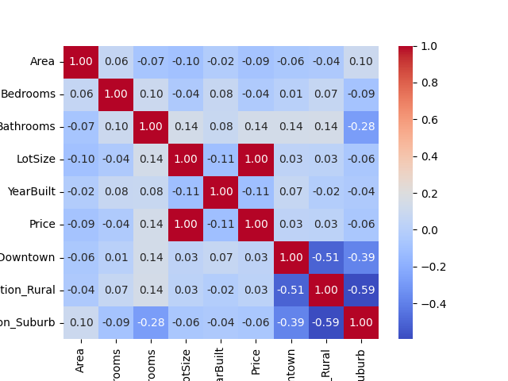

# EDA Report

## Pairplot Visualization

## Correlation Heatmap

## Model Metrics
| Model | Mean Squared Error |
|-------|--------------------|
| Linear Regression | 2908073482.61 |
| Random Forest | 123802748037259.88 |
| Gradient Boosting | 155688867786355.03 |
